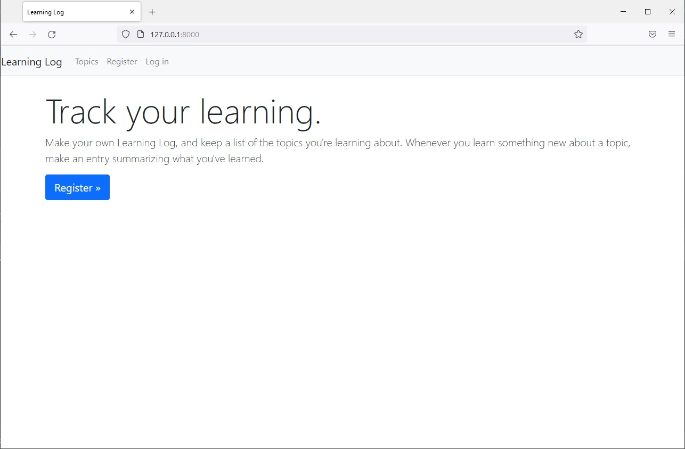
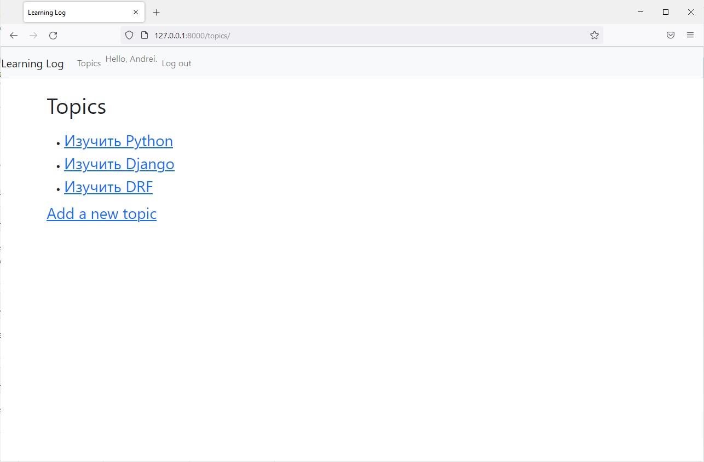
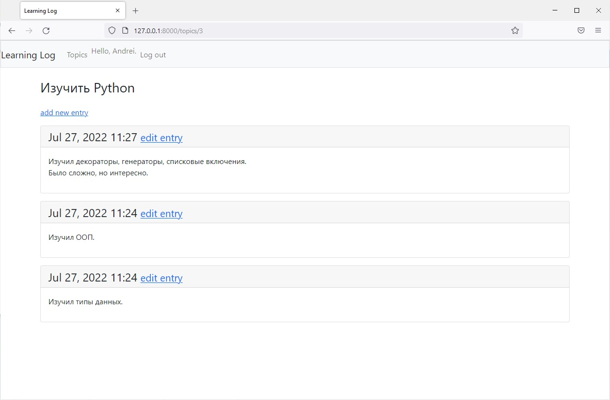

# Learning Log
___


Веб-приложение при помощи которого 
пользователь сможет вести журнал интересующих его тем и создавать записи 
в журнале во время изучения каждой темы. Домашняя страница Learning Log 
содержит описание сайта и приглашает пользователя зарегистрироваться 
либо ввести свои учетные данные. После успешного входа пользователь
получает возможность создавать новые темы, добавлять новые записи
и редактировать существующие записи.




## Настройка перед запуском

Первое, что нужно сделать, это cклонировать репозиторий:

```sh
$ git clone https://github.com/Andrei2020-web/Learning_log.git
$ cd learning_log
```

Создайте виртуальную среду для установки зависимостей и активируйте ее:

```sh
$ virtualenv venv
$ source venv/bin/activate
```

Затем установите зависимости:

```sh
(venv)$ pip install -r requirements.txt
```

Запускаем сервер:

```sh
(venv)$ python manage.py runserver
```
